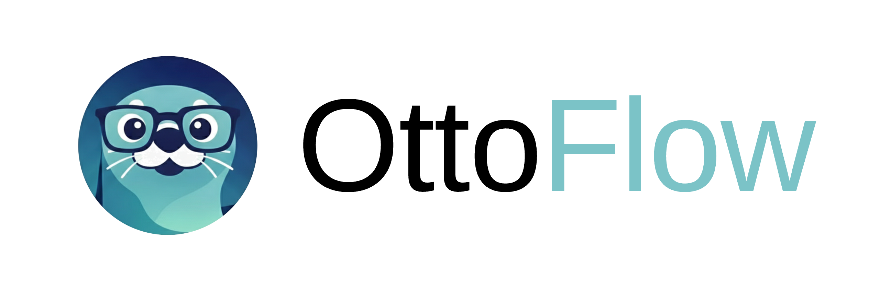
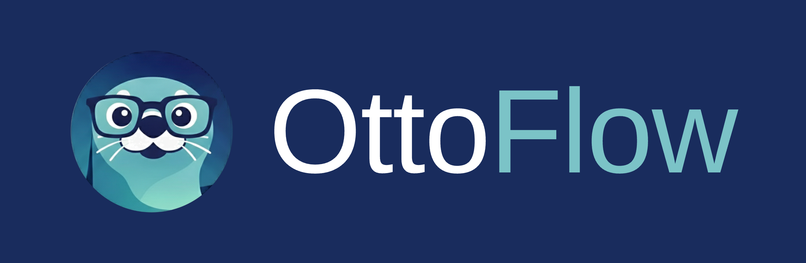
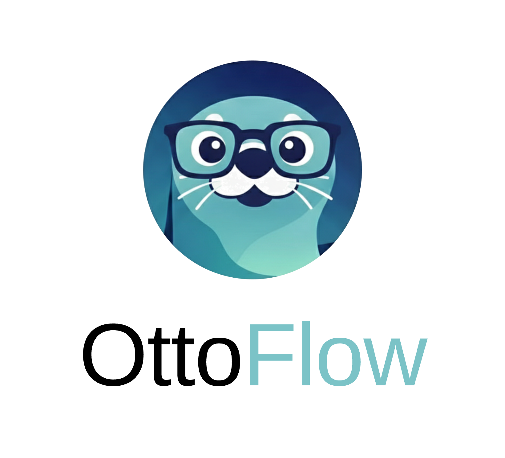
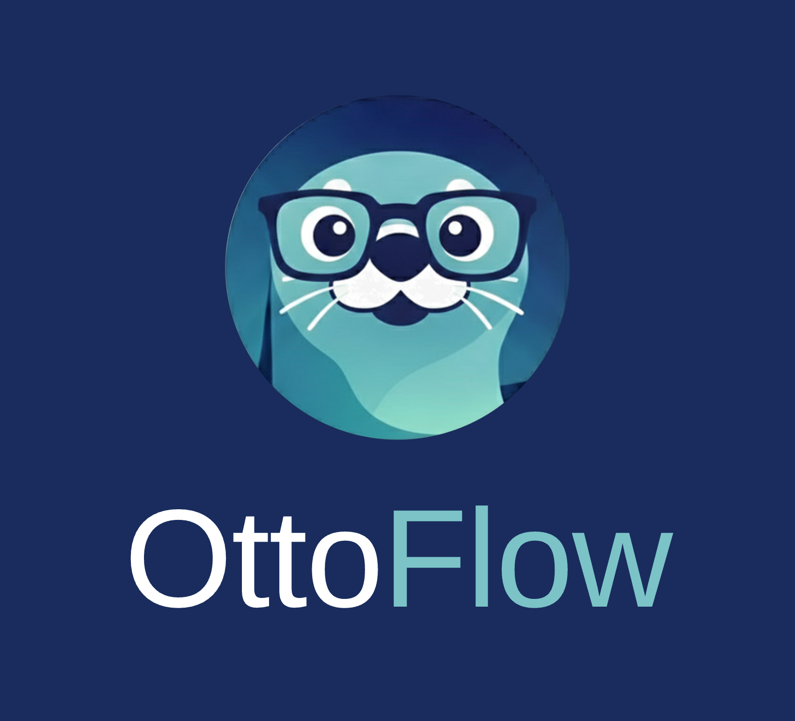

# OttoFlow brand guide

Colour, type and logo usage for OttoFlow. Every colour below is sampled directly
from `images/brand/ottoflow-horizontal-light.png`; typography follows the Nirmata visual identity.

Design tokens: [`ottoflow-tokens.css`](ottoflow-tokens.css).

---

## Logo

### Horizontal lockup

The primary form. Use it wherever there is room for a wide mark — README headers,
site navigation, slide masters, docs.

On Otter Navy or any dark surface, "Otto" switches to white. The teal stays the same.

### Vertical lockup

For square or narrow spaces — social avatars with a name, conference banners,
sticker sheets, centred title cards.

| Light | Dark |
|---|---|
|  |  |

### Icon

| Asset | File | Use |
|---|---|---|
| Circular mark, transparent | [`ottoflow-icon-circle.png`](../../../images/brand/ottoflow-icon-circle.png) | Avatars, favicons, anywhere the background shows through |
| Rounded square on Otter Navy | [`ottoflow-icon-rounded.png`](../../../images/brand/ottoflow-icon-rounded.png) | App icons, PWA, Apple touch icon |

Pre-scaled sizes live in [`images/brand/icons/`](../../../images/brand/icons/):
`ottoflow-icon-{512,256,128,64,32,16}.png` and `ottoflow-rounded-{512,192,180}.png`.

### Clear space and minimum size

- Clear space on all sides equals **half the height of the otter mark**.
- Horizontal lockup: never below **120 px** wide on screen, **30 mm** in print.
- Icon alone: never below **16 px**. Below 32 px use the rounded-square icon —
  the whiskers stop resolving.
- The gap between mark and wordmark is fixed at **21% of the mark height**.

### Don't

- Recolour the otter, or place it on a busy photograph.
- Set "OttoFlow" in a single colour — the two-tone split *is* the wordmark.
- Stretch, rotate, or add a drop shadow to the mark.
- Use the teal for body copy or headlines. It is a mark and accent colour only.

---

## Colour

### OttoFlow palette

| Swatch | Name | Hex | Use |
|---|---|---|---|
| ▉ | OttoFlow Teal | `#7BC3C7` | Signature accent — "Flow" in the wordmark, active states |
| ▉ | Otter Navy | `#192C5D` | Dark surfaces, glasses frame |
| ▉ | Deep Sea | `#1A3D6F` | Icon backdrop, dark panels |
| ▉ | Wordmark Black | `#000000` | "Otto" in the logotype **only** |
| ▉ | Mint | `#80CDC4` | Supporting fill |
| ▉ | Shallow | `#A7D7D9` | Supporting fill |
| ▉ | Mist | `#D8EAEA` | Tints, chips, table stripes |
| ▉ | Frost | `#F3F9F9` | Page and section backgrounds |

### Inherited Nirmata primaries

OttoFlow is a Nirmata product, so it inherits Nirmata Navy for all text and
Nirmata Blue for interactive elements.

| Name | Hex | Use |
|---|---|---|
| Nirmata Navy | `#1E345D` | All text — never `#000` outside the logotype |
| Nirmata Blue | `#2E5596` | Buttons, links |
| Nirmata Sky | `#71CFEB` | Do not mix with OttoFlow Teal on one surface |
| Nirmata Red | `#FF5859` | Errors only |
| Nirmata Gray | `#D4DCE5` | Dividers, neutral panels |

Nirmata Sky and OttoFlow Teal are close in hue but Sky is brighter. Pick one
per surface rather than using both.

---

## Type

| Role | Family | Weights | Notes |
|---|---|---|---|
| Headlines | **Ubuntu** | 300 / 400 / 500 | The bigger the size, the lighter the weight. Always Nirmata Navy — never teal. |
| Body & UI | **Open Sans** | 400 / 600 / 700 | 16 px / 1.55 body. 600 for labels and buttons. 700 for inline emphasis only. |
| Logotype | **Arimo** | 400 | Reproduction face for the existing wordmark. Not for anything else. |
| Code | system mono | — | `ui-monospace, 'SF Mono', Menlo, Consolas, monospace` |

### Scale

| Token | Size / line-height | Weight |
|---|---|---|
| Display | 64 / 1.1 | Ubuntu 300 |
| H1 | 44 / 1.15 | Ubuntu 300 |
| H2 | 32 / 1.2 | Ubuntu 400 |
| H3 | 24 / 1.25 | Ubuntu 500 |
| H4 | 18 / 1.3 | Ubuntu 500 |
| Body | 16 / 1.55 | Open Sans 400 |
| Small | 14 / 1.5 | Open Sans 400 |
| Caption | 12 / 1.45, uppercase, 0.08em tracking | Open Sans 600 |

### The wordmark

The existing logotype is set in a Helvetica-class grotesque at Regular weight.
It is reproduced here in **Arimo**, which is metrically identical and
open-licensed. Treat the wordmark as fixed artwork: never re-set it in Ubuntu,
and never re-space it. Ubuntu is for headlines that sit *next to* the logo, not
for the logo itself.

---

## Writing

- Sentence case for headings and UI.
- "We" for the team, "you" for the reader.
- No emoji in product UI. One exclamation point per screen, at most.
- No all-caps body copy; all-caps is for 12 px captions only.

---

## A note on resolution

The otter in `images/brand/ottoflow-horizontal-light.png` is **392 × 392 px** of raster artwork — that
is the ceiling on real detail. The exports here resample it with high-quality
filtering and hold up to roughly **400 px on screen** or **40 mm in print**. The
wordmark in every export is live type, so it stays crisp at any size.

For billboard, large-format print, or true vector output, the original
illustration source (SVG or AI) is needed.
