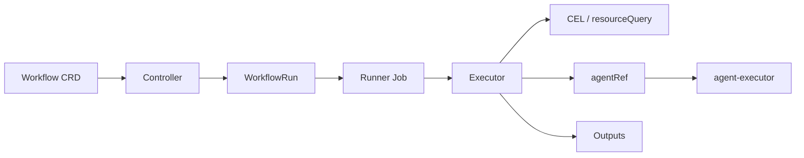

# OttoFlow Architecture

This document describes the three container images that make up OttoFlow, what each one does, and which image to update for a given type of change.



---

## The Three Images

OttoFlow is composed of three separate binaries/images that serve distinct roles:

| Image name | Binary source | Kubernetes resource | Lifecycle |
|---|---|---|---|
| `ghcr.io/nirmata/ottoflow/controller` | `cmd/controller/` | Deployment (always running) | Persistent service |
| `ghcr.io/nirmata/ottoflow/agent-executor` | `cmd/agent-executor/` | Deployment (always running) | Persistent HTTPS service |
| `ghcr.io/nirmata/ottoflow/workflow-runner` | `cmd/workflow-runner/` | **Job pod** (ephemeral) | One pod per WorkflowRun |

### controller (image: `ghcr.io/nirmata/ottoflow/controller`)

The controller is the main Kubernetes operator. It:

- Watches Workflow and WorkflowRun CRDs
- Validates WorkflowRun inputs and builds the dependency DAG
- Spawns a Kubernetes Job for each WorkflowRun, injecting the runner image and configuration
- Manages TLS certificates for the agent-executor service (internal cert controller)
- Serves validating admission webhooks for Workflow, WorkflowRun, Agent, and MCPServer CRDs
- Handles cron and event triggers (runs scheduled/event-driven WorkflowRun creation under leader election)

The controller does **not** execute workflow steps itself. It delegates all execution to the workflow-runner Job.

### agent-executor (image: `ghcr.io/nirmata/ottoflow/agent-executor`)

The agent-executor is a persistent HTTPS service. It:

- Listens on port 8443 (TLS)
- Handles `POST /api/exec/{namespace}/{agentName}` requests from workflow-runner pods
- Looks up the Agent CRD, builds the LLM prompt, calls the LLM provider, and returns the response
- Authenticates callers via Kubernetes SubjectAccessReview (RBAC on `configmaps/agent-executor-caller`)
- Manages MCP client connections for agent tool registration

The agent-executor is essentially a stateless LLM proxy: it receives a prompt and context map, calls the LLM, and returns the text response and any extracted outputs.

### workflow-runner (image: `ghcr.io/nirmata/ottoflow/workflow-runner`)

The workflow runner is an **ephemeral Job pod** — not a Deployment. It:

- Is spawned by the controller once per WorkflowRun (as a Kubernetes Job)
- Loads the Workflow and WorkflowRun CRDs from the API server
- Executes all step types: CEL expression steps, resource queries, Prometheus queries, mutate steps, agent steps, MCP tool calls, sub-workflow references
- Evaluates all CEL expressions using the full Kyverno + Kubernetes CEL library stack
- For agent steps: calls the agent-executor service via HTTPS (`POST /api/exec/{namespace}/{agentName}`)
- Writes step outputs and final status back to the WorkflowRun status

The workflow runner pod terminates when the WorkflowRun completes (or fails). A new pod is created for each WorkflowRun.

---

## Execution Flow

```
User
  |
  | kubectl apply WorkflowRun (or trigger fires)
  v
Controller (Deployment)
  |
  | Validates inputs, builds DAG
  | Creates Kubernetes Job with --workflow-runner-image=<image>
  v
Workflow Runner (Job pod, ephemeral)
  |
  | Executes CEL steps, resource queries, etc. in-process
  |
  | For each agentRef step:
  |   POST https://ottoflow-agent-executor:8443/api/exec/{ns}/{agentName}
  |   (mTLS: runner mounts agent-executor CA; RBAC: SubjectAccessReview)
  v
Agent Executor (Deployment, HTTPS service)
  |
  | Looks up Agent CRD
  | Builds prompt, calls LLM provider
  v
LLM (OpenAI, Anthropic, Azure OpenAI, Google, local, etc.)
```

---

## Which image to update for a given change

This is the most important section for troubleshooting and deployments.

| Type of change | Image to update | How to update |
|---|---|---|
| CEL expression bug or library update | **workflow-runner only** | Change `--workflow-runner-image` on the controller (see below) |
| Workflow step execution logic (any step type) | **workflow-runner only** | Change `--workflow-runner-image` on the controller |
| Prometheus/resource query execution | **workflow-runner only** | Change `--workflow-runner-image` on the controller |
| LLM call logic, agent prompt building, output extraction | **agent-executor** | Redeploy agent-executor with new image |
| MCP client/tool registration | **agent-executor** | Redeploy agent-executor with new image |
| Agent-executor TLS / auth (SubjectAccessReview) | **agent-executor** | Redeploy agent-executor with new image |
| CRD reconciliation, Job spawning, trigger handling | **controller** | Redeploy controller with new image |
| Validating webhook logic | **controller** | Redeploy controller with new image |
| TLS cert management for agent-executor | **controller** | Redeploy controller with new image |

**Key insight**: The CEL evaluation library and all workflow step execution logic lives entirely in the workflow-runner. When a CEL bug is fixed or a new library is added, only the runner image needs to change — the controller and agent-executor do not need to be redeployed.

---

## Updating the workflow-runner image without redeploying the controller

The runner image is passed to the controller as the `--workflow-runner-image` flag. When this flag changes, the controller picks it up on the next WorkflowRun — no full controller redeploy is required if only the flag value changes.

### Via Helm (recommended)

Set `workflowRunner.image` in your values file, or pass it as a flag in `controller.args`:

```yaml
controller:
  args:
    - --leader-elect
    - --workflow-runner-image=ghcr.io/nirmata/ottoflow/workflow-runner:v1.2.3
```

Then upgrade:

```bash
helm upgrade ottoflow ./charts/ottoflow -f my-values.yaml --namespace ottoflow
```

### Via kubectl patch (quick fix / testing)

```bash
kubectl patch deployment ottoflow-controller-manager -n ottoflow \
  --type=json \
  -p='[{"op":"replace","path":"/spec/template/spec/containers/0/args","value":["--leader-elect","--workflow-runner-image=ghcr.io/nirmata/ottoflow/workflow-runner:v1.2.3"]}]'
```

After patching, the controller pod restarts with the new flag. All subsequent WorkflowRuns will use the new runner image. In-flight WorkflowRuns continue with the image they were started with.

---

## TLS and internal security

- The agent-executor serves **HTTPS only** (port 8443, TLS 1.2+)
- The controller provisions a self-signed CA and TLS certificate for the agent-executor Service using the internal cert controller (no cert-manager required)
- Runner pods mount the agent-executor CA secret (configured via `--workflow-runner-agent-executor-ca-secret` on the controller) so they can verify the agent-executor's certificate
- Callers are authenticated via Kubernetes SubjectAccessReview: the agent-executor checks that the calling identity has `get` on `configmaps/agent-executor-caller` in the configured namespace
- LLM credentials (e.g., `NIRMATA_LLM_TOKEN`) are injected into runner pods via Kubernetes Secret references in `WorkflowRun.spec.execution.job.env`; the runner forwards them to the agent-executor via the `X-LLM-Env` header (base64-encoded JSON)

For full details on agent-executor security, see [Agent Executor Security](agent-executor-security.md).

---

## Where CEL evaluation happens

All CEL evaluation occurs **inside the workflow-runner pod**. This includes:

- Expression steps and output expressions
- Conditions and retry expressions
- `resource.Get()`, `resource.List()`, and other Kubernetes resource macros
- `prometheusMetrics()` and other Kyverno CEL library functions
- Template variable substitution in `prometheusQuery` steps
- Prompt template rendering in `agentRef` steps

Because all CEL logic is in the runner, fixing a CEL library bug or adding a new function only requires updating the runner image.

---

## Local execution (CLI mode)

When using the `ottoflow` CLI with `--workflow-dir` (local execution mode), the workflow runner runs in-process inside the CLI — there is no Job pod. In this mode, agent steps call the LLM directly without going through the agent-executor HTTPS service. The same CEL evaluation code is used.

This means the CLI bundles the same workflow-runner logic and uses the same CEL libraries. CEL-related fixes in the runner image will not automatically apply to the CLI; a new CLI binary must be built.
